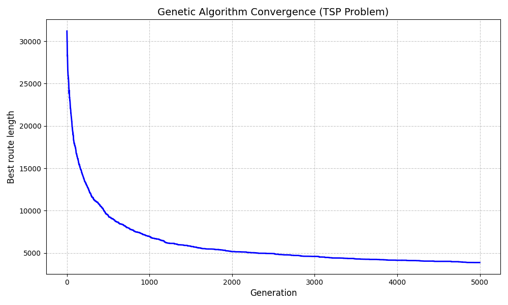

# Genetic Algorithm for the Traveling Salesperson Problem (TSP)

## About the Project
This repository contains a Python implementation of a genetic algorithm designed to solve the classic **Traveling Salesperson Problem (TSP)**. The goal of the algorithm is to find the shortest possible route that visits a given set of cities exactly once and returns to the starting point. 

This specific implementation is tested on the `a280.txt` dataset, optimizing a route across 280 cities based on a distance matrix.

To find near-optimal solutions, the script simulates natural evolution using the following genetic operators:
* **Tournament Selection:** Evaluates and selects the fittest individuals from random subgroups to become parents.
* **Order Crossover (OX):** A specialized crossover method for permutation-based problems, ensuring no duplicate cities appear in the offspring's route.
* **Inversion Mutation:** Reverses a random segment of the route to maintain genetic diversity and prevent the algorithm from getting stuck in local minima.

## Technologies Used
- **Python 3.12.3**
- **NumPy**
- **Matplotlib**
- **Random**

## How to Run the Project

1. **Clone the repository:**
   ```bash
   git clone https://github.com/zielantmagda/genetic-algorithm-tsp.git

2. **Navigate to the project directory:**
   ```bash
   cd genetic-algorithm-tsp

3. **Install the required dependencies:**
   ```bash
   pip install numpy matplotlib

4. **Run the algorithm:**
   
	Make sure the `a280.txt` dataset file is located in the same directory as the main script!
   ```bash
   python genetic-algorithm-tsp.py

## Results & Visualization

The algorithm tracks the best route length across 5000 generations. Below is the convergence plot demonstrating how the algorithm optimizes the route over time:



## Contact & Contribution

This project was developed as a part of my geospatial computer science studies and personal portfolio. If you have any questions or suggestions for optimization (e.g., multithreading, different crossover methods), feel free to contact me. 😊
